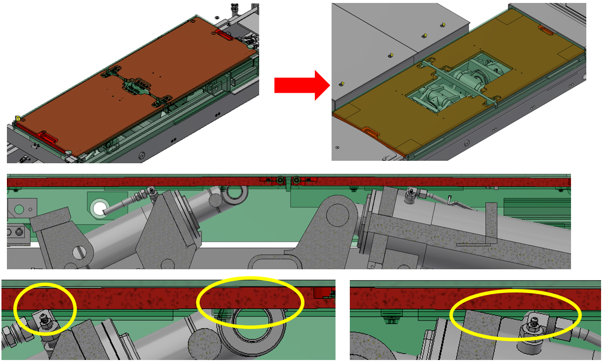

# 検討内容（リンク間支持部材の検討・上段リフト4t化の検討）     
       
<a href="./アライメントマルチ4t新商品企画書.pdf">📄 新商品企画書を見る</a>

## 担当別進捗  

| 担当 | 主な検討内容 | 結果 | 今後 |
|---|---|---|---|
| 中村 | リンク間支持部材の検討（レベル精度の向上） | 3t解析で変位低減効果を確認 | 支持構造と解除機構を具体化する |
| 淵田 | 上段リフト4t化の検討 | 強度上大きな問題はないと判断 | 別検討を進める |
 
 

## ★リンクの検討

  

<table>
  <tr>
    <td align="center"><b>現行リンク解析</b></td>
    <td align="center"><b>支持部材追加解析</b></td>
  </tr>
  <tr>
    <td></td>
    <td></td>
  </tr>
</table>

 

  

## 下段リンク・支持部材

- ドライブオンのレベル性能確保に向けて、リンク間に支持部材を追加する構造を検討中。
- 現行リンクで3t相当の荷重をかけた解析では、前方約2.8mm、後方約5.2mmの変位を確認。
- リンク間に支持部材を追加した場合、前方約2.1mm、後方約1.1mmまで変位が低減した。
- 特に後方側で支持部材による変位抑制効果が大きいことを確認。
- 前方側はシリンダが配置されておりスペースが少ないため、既存のツメ・ラックを利用する方向で検討中。
- 後方側に支持部材を配置し、前後でレベルを確保する構造を検討している。
- 現在は支持部材の長さ、受け角度、解除機構について検討中。

 
 

## ★上段リフト受台の検討

### 検討画像

<table>
  <tr>
    <td align="center"><b>スライドプレート干渉部分</b></td>
  </tr>
  <tr>
    <td></td>
  </tr>
</table>

 

<b>強度解析結果</b>

  

 

<b>強度解析結果</b>

  

- BSCをベースとした、4t対応の上段リフト受台を検討中。
- スライドプレートはシリンダ等との干渉を避けるため、切欠きを設ける構造で検討。
- スライドプレート単体の強度を確認した結果、プレートサイズを大きくすることで強度上は成立できそうな見通し。
- 受台からスライドさせた状態についても、板厚アップや補強追加により成立できそうな感触を得ている。
- 現状、受台全体の強度解析を進めている。

### 2026/10/5更新　4t上段リフトの見通しが立った
- BSC32KUVの構造をベースに、4t仕様のスライドプレート・受台の強度解析を実施。
- スライドプレートは局部的な応力集中はあるものの、高応力域はBSCと同等以下。
- 受台も一部で局部応力は高くなるが、高応力域の広がりはBSCと同等以下。
- 受台寸法の拡大、補強追加、一部板厚変更により4t対応を検討。
- BSCの使用実績も踏まえ、現構造で4t化に大きな強度上の問題はないと判断。
